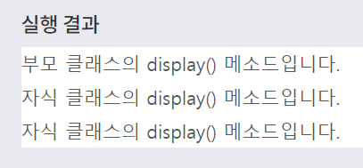
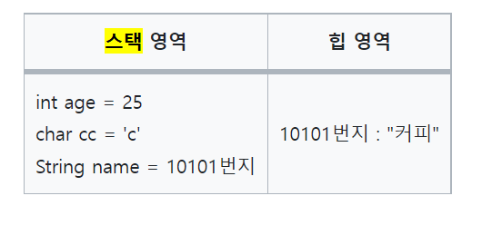

## TIL

- 추상 클래스 

```
public class InterfaceExample {

	public static void main(String[] args) {
		// TODO Auto-generated method stub
		MemberManager member = new MemberManager();
	}

}
```


추상클래스 역시 구현을 안하면 must inherit 경고 메시지가 뜬다. 
인터페이스, 추상클래스의 상속을 받으면, 해당 클래스의 메서드를 구현하는 작업 = 상속세를 낸다고 생각하자. 


-  변수의 초기화 


변수를 final 선언할 때는 변수생성과 동시에 초기화 해야된다.
인스턴스 변수나 클래스 변수는 생성과 동시에 초기화를 해야하기 때문이다.


```
public class finalVariable {

	    final int instanceVariable = 1;
	
}

```

매개변수는 초기화가 되어서 넘어오기 때문에, 선언 시 초기화 할 필요 없다.
지역변수는 메서드를 선언하는 중괄호 내에서만 참조되니, 다른 곳에서 변경할 일이 없다. 매개변수, 지역변수는 초기화 안해도 컴파일에 문제가 없다.

아래와 같이 선언하는 건 지양해야 한다.


final 로 선언된 dto 인데 어떻게 이 경우에는 새 값 할당이 가능할까? 
dto 객체 자체는 final 로 생성되었기 때문에 또 생성할 수 없다. 하지만 객체 안에 선언된 name, phone, email은 final 이 아니다. 
해당 클래스가 final 이라고 그 안의 ㅇ니스턴스, 클래스 변수도 final 은 아니기 때문에 문제없이 컴파일 된다. 
```
public class FinalReferenceType {
final MemberDto dto = new MemberDto();

	public static void main(String args[]) {
		FinalReferenceType referenceType = new FinalReferenceType();
		referenceType.checkDto();
	}

	public void checkDto() {
		System.out.println(dto);
//		dto = new MemberDto();
dto.name = "Sangmin";
System.out.println(dto);
```
	}
}


- 오늘의 에러 

여기서 한참 헤맸는데, 알고보니 마지막에 ; 세미콜론으로 마무리해주지 않아서 인식을 못한거였다. 



## Review
오늘 잘한 것:

## Note 
잠깐 미뤄두었던 프로젝트를 다시 시작해야 한다. 공부 기간인 6주동안 틈틈이 해도 좋을 것 같다. 
프로젝트를 할 때 고민해보면 좋을 것. 
-내가 하고 있는 프로젝트를 어떻게 하면 다른 사람들에게 더 잘 보여줄 수 있을까? (백엔드만 있는데 )
-어떻게 해야 지금 내가 짜는 이 코드의 가독성을 높힐 수 있을까?
(지금은 개발 단계이다보니 주석이 많이 어지럽다. 기간 내에 이것도 꼭 정리하자)

## Routine 
Calm Meditate 10 min 
core 13 min 
cycle or walk 30 min 