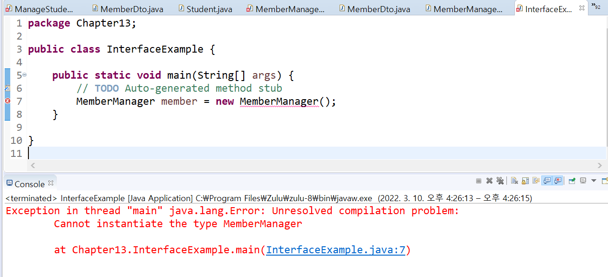
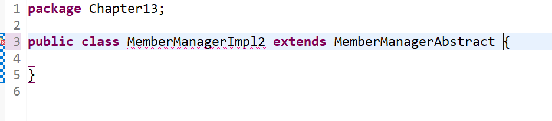
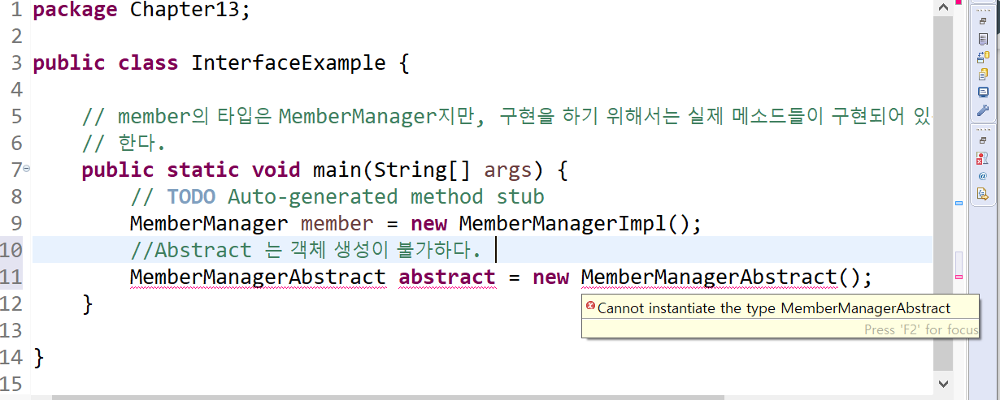
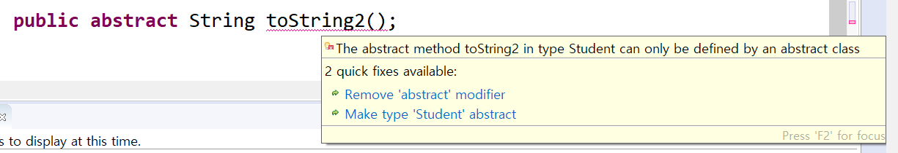
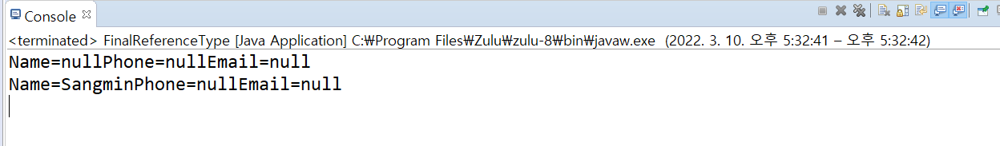
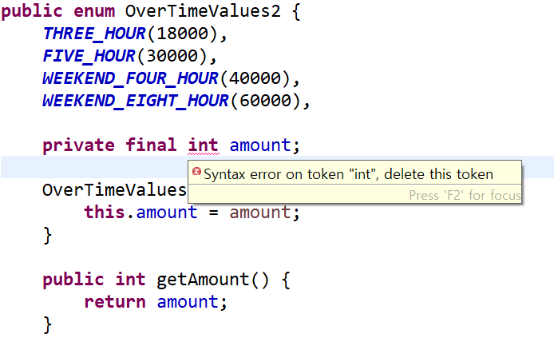

## TIL

1. 추상 클래스

위의 코드는 컴파일 에러가 있다. 

```
public class InterfaceExample {

	public static void main(String[] args) {
		// TODO Auto-generated method stub
		MemberManager member = new MemberManager();
	}

}
```

MemberManager가 abstract 이기 때문에 instantiate 되지 않는다는 것이다.
MemberManager는 구현이 없는 인터페이스 이기 때문에, 구현체로 생성 해야한다.
여기 MemberManager 를 구현한 MemeberManagerImpl() 로 하면 에러 메시지가 사라진다. 

```
public class MemberManagerImpl implements MemberManager {

	@Override
	public boolean addMember(MemberDto member) {
		// TODO Auto-generated method stub
		return false;
	}

	@Override
	public boolean removeMember(String name, String phone) {
		// TODO Auto-generated method stub
		return false;
	}

	@Override
	public boolean updateMember(MemberDto member) {
		// TODO Auto-generated method stub
		return false;
	}
}

```

```
public class InterfaceExample {

	// member의 타입은 MemberManager지만, 구현을 하기 위해서는 실제 메소드들이 구현되어 있는 MemberManagerImpl로
	// 한다.
	public static void main(String[] args) {
		// TODO Auto-generated method stub
		MemberManager member = new MemberManagerImpl();
	}

}
```


추상클래스 역시 구현을 안하면 must inherit 경고 메시지가 뜬다. abstract 으로 선언된 메서드를 구현하지 않았기 때문이다. 
인터페이스, 추상클래스의 상속을 받으면, 해당 클래스의 메서드를 구현하는 작업을 해야한다. 상속세를 내는 것 처럼 꼭 해야하는 
작업이라고 생각하자.




- 추상 클래스와 일반 클래스의 차이
  (1) 추상 클래스는 일반 클래스와 달리 객체 생성이 불가하다
아래 클래스 밑에 추상 클래스인 MemberManagerAbstract의 객체를 생성 시도해보았다. 


```
public abstract class MemberManagerAbstract {
	public abstract boolean addMember(MemberDto member);

	public abstract boolean removeMember(String name, String phone);

	public abstract boolean updateMember(MemberDto member);

	public void printLog(String data) {
		System.out.println("Data=" + data);
	}
}
```
(2) 추상 클래스를 이용하려면 꼭 상속을 받아야 한다 (extends 추상클래스)
클래스들의 공통적인 특성을 추출해서 선언하고, 타 클래스에서 상속해서 효율적으로 사용하고 싶을 때, 추상 클래스를 만드는 게 아닐까?

왜 굳이 클래스가 아닌 추상 클래스를 쓸까? 라는 질문이 잘 해결되지 않아서, 오래 생각했다. 
추상 클래스는 완전하지 않은 클래스이다. 부족하다는 뜻일 수도 있지만, 한편으로는 다르게 확장될 수 있는 가능성을 지닌다.
완전하지 않기 때문에 이 가능성 덕분에 좀 더 확장 가능하고 다양한 프로그램을 개발할 수 있다.
새로운 클래스를 작성하는 데 밑바탕이 되는, 설계로서의 틀을 갖추고 클래스를 작성하게 도와준다.

(3) 일반 클래스에서는 abstract method를 쓸 수 없다. 


(3) 왜 굳이 추상 메서드를 써야할까?
-추상이 아니라면, 부모가 정의한대로 쓰면 된다. 하지만 자식에서 재정의가 꼭 필요한 메서드가 있다면 abstract method를 해서 추가로 구현하도록 하는 것이다.
-메서드를 몸통 {} 없이 쓸 경우, requires a body 라는 알림이 뜬다. 일반 메서드는 구현부가 있어야하지만, 추상 메서드는 구현부가 없어도 된다. 

추상 클래스와 인터페이스 비교 
공통점
구현된 코드가 없기 때문에, 인스턴스 생성 등의 행위가 불가함. 상속받고, 구현받아 써야한다. 

차이점:
-인터페이스는 추상 메서드와 상수로만 이루어져 있다. 추상클래스는 추상 메서드가 0개 이상 있으면 된다. 단 추상 메서드가 하나라도 있으면 abstract class 선언을 한다. 
-참고로 인터페이스는 메서드들은 public abstract 예약어를 명시적으로 쓰지 않아도 컴파일 과정에서 자동으로 추상 메서드로 변환된다. 
abstract 이 안써져 있어도 사실상 추상메서드다. 

[아래는 다른 글에서 썼던 건데, 붙여넣었다] 
-인터페이스는 대상이 되는 시스템을 제어할 때 사용하고 추상 클래스는 부모 클래스의 기능을 사용하고 확장하는 용도로 씁니다.
인터페이스는 하나의 명세로 개발자들 간의 협업을 돕습니다. 개발자 A 가 좋아요 기능을 만들고, 개발자 B가 좋아요 기능을 사용하는 글작성 클래스를 만든다고 가정하겠습니다.
B는 좋아요 기능에 의존하므로, likedDummy 같은 가짜 클래스를 만들어두고 본인의 기능을 개발할 것입니다. 이럴 경우 A 와 B의 좋아요에 대한 이해가 다를 수 있습니다 (매개변수의 차이 등)
이때 A와 B 모두 likedTemp 라는 동일한 인터페이스를 implements 하면서 코드를 개발하면, 구체적으로 코드로 합의한 채로 시작할 수 있습니다.
더불어 실무에서는 프레임워크와 기존 소스코드를 사용해서 개발하는 경우가 많아서, 인터페이스가 많이 쓰이기도 합니다.


2. 변수의 초기화 


변수를 final 선언할 때는 변수생성과 동시에 초기화 해야된다.
인스턴스 변수나 클래스 변수는 생성과 동시에 초기화를 해야하기 때문이다.

```
public class finalVariable {

	    final int instanceVariable = 1;
	
}

```

매개변수는 초기화가 되어서 넘어오기 때문에, 선언 시 초기화 할 필요 없다.
지역변수는 메서드를 선언하는 중괄호 내에서만 참조되니, 다른 곳에서 변경할 일이 없다. 매개변수, 지역변수는 초기화 안해도 컴파일에 문제가 없다.
아래와 같이 선언하는 건 지양해야 한다.


final 로 선언된 dto 인데 어떻게 이 경우에는 새 값 할당이 가능할까? 
dto 객체 자체는 final 로 생성되었기 때문에 또 생성할 수 없다. 하지만 객체 안에 선언된 name, phone, email은 final 이 아니다. 
해당 클래스가 final 이라고 그 안의 인스턴스, 클래스 변수도 final 은 아니기 때문에 문제없이 컴파일 된다. 
```
public class FinalReferenceType {
final MemberDto dto = new MemberDto();

	public static void main(String args[]) {
		FinalReferenceType referenceType = new FinalReferenceType();
		referenceType.checkDto();
	}

	public void checkDto() {
		System.out.println(dto);
//		dto = new MemberDto();
dto.name = "Sangmin";
System.out.println(dto);
```
	}
}


- 오늘의 에러 

여기서 한참 헤맸는데, 알고보니 마지막에 ; 세미콜론으로 마무리해주지 않아서 인식을 못한거였다. 



## Review
오늘 잘한 것:

## Note 
잠깐 미뤄두었던 프로젝트를 다시 시작해야 한다. 공부 기간인 6주동안 틈틈이 해도 좋을 것 같다. 
프로젝트를 할 때 고민해보면 좋을 것. 
-내가 하고 있는 프로젝트를 어떻게 하면 다른 사람들에게 더 잘 보여줄 수 있을까? (백엔드만 있는데 )
-어떻게 해야 지금 내가 짜는 이 코드의 가독성을 높힐 수 있을까?
(지금은 개발 단계이다보니 주석이 많이 어지럽다. 기간 내에 이것도 꼭 정리하자)

## Routine 
Calm Meditate 10 min 
core 13 min 
cycle or walk 30 min 