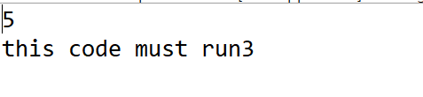
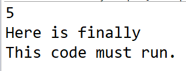
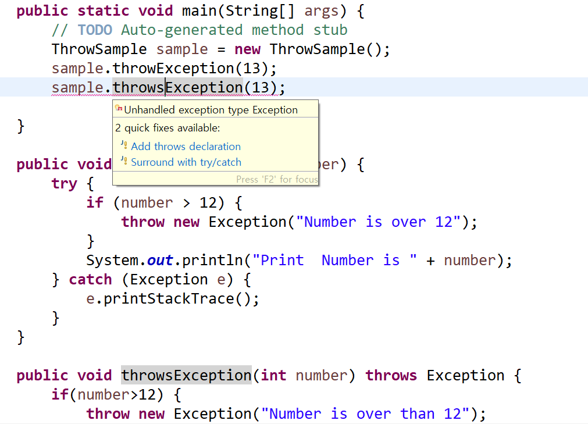
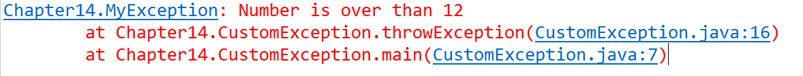
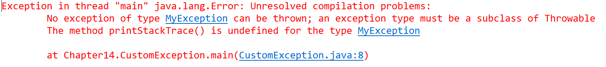

14장 예외처리 

예외처리는 한 번에 이해하려고 하기보다는, 가볍게 훑고 한번 더 보자. 

모든 예외의 부모 클래스는 java.lang.Exception 

예외가 발생하여 catch 블록이 실행된다고 해서, try 블록 내에 실행된 모든 문장이 무시되는 것은 아니다.
checkVariable3() 예제에서 예외는 intArray[5] 를 호출하는 순간 발생한다 
그렇기 때문에, 그 이전의 코드인 int[] intArray = new int[5]; 는 문제 없이 실행된다. 
catch 에서 사용하는 변수는 try블록 내부가 아닌, 앞에 선언되어야 한다. 

```
public class ExceptionVariable {

	public static void main(String[] args) {
		// TODO Auto-generated method stub
		ExceptionVariable sample = new ExceptionVariable();
		sample.checkVariable3();
	}

	public void checkVariable() {
		int[] intArray = new int[5];
		try {
			System.out.println(intArray[5]);
		} catch (Exception e) {
			System.out.println(intArray.length);
		}
		System.out.println("this code must run");
	}

	// compile error example
	public void checkVariable2() {
		try {
			int[] intArray = new int[5];// try블록 내에 선언하면, catch 블록에서는 cannot find symbol
			System.out.println(intArray[5]);
		} catch (Exception e) {
			System.out.println(intArray.length);
		}
		System.out.println("this code must run");
	}

	// compile error example
	public void checkVariable3() {
		int[] intArray = null;
		try {
			intArray = new int[5];
			System.out.println(intArray[5]); 
		} catch (Exception e) {
			System.out.println(intArray.length);
		}
		System.out.println("this code must run3");
	}
}

```



finally는 try/catch 여부에 상관 없이 일어난다. 

```
public class FinallySample {
	public static void main(String args[]) {
		FinallySample sample = new FinallySample();
		sample.finallySample();
	}

	public void finallySample() {
		int[] intArray = new int[5];

		try {
			System.out.println(intArray[5]);
		} catch (Exception e) {
			System.out.println(intArray.length);
		} finally {
			System.out.println("Here is finally");
		}
		System.out.println("This code must run.");

	}

}

```


```
public class MultiCatchSample {

	public static void main(String[] args) {
		// TODO Auto-generated method stub
		MultiCatchSample sample = new MultiCatchSample();
		sample.multiCatch();
	}

	public void multiCatch() {
		int[] intArray = new int[5];
		try {
			System.out.println(intArray[5]);
		} catch (Exception e) {
			System.out.println(intArray.length);
		} catch (ArrayIndexOutOfBoundsException e) {
			System.out.println("ArrayIndexOutOfBoundsException ocurred");
		}
	}

}
```
위와 같이 처리할 경우, ArrayIndexOutOfBoundsException 에서 already handled by catch block exception.
모든 예외의 부모 클래스는 java.lang.Exception 이기 때문에, 이미 Exception 이 처리해줬는데- 하면서 컴파일 에러를 터트리는 것이다. 
Exception 클래스로 catch 하는 것을 가장 아래에 추가하는 것을 권장한다. 모든 예외 클래스의 부모는 Exception 이다. catch() 에 Exception 
타입의 참조 변수를 선언해놓으면, 어떤 종류의 예외가 발생하더라도 이 catch 블록에 의해 처리된다. 

try/catch 문의 흐름

(1) try 블럭 내에서 예외 발생
- 발생한 예외와 관련이 있는 catch 블록을 찾아서 실행한다.
-일치 catch 블록을 찾음, catch 블록 내의 문장을 실행. 전체 try-catch 문 빠져나가서 다음 문장 계속 수행함. 
일치하는 catch 블록을 찾지 못할 경우, 예외는 처리되지 못한다.

(2) try 블럭 내에서 예외 발생 x

catch 블록 거치지 않고, try-catch 를 빠져나가서 수행 계속함. 

참고
- try 다음에 오는 catch 블록은 한 개 이상 올 수 o. 
-먼저 선언한 catch 블록의 예외 클래스가 다음에 선언한 catch 블록의 부모에 속하면, 자식에 속하는 catch 블록은 절대 실행될 
일이 없기 때문에 컴파일 되지 않는다. 

3가지 타입의 예외
(1) error: 자바 프로그램 밖에서 발생한 예외. 오류의 이름이 Error 로 끝나면 에러고 Exception 으로 끝나면 예외다. 
에러는 프로세스에, exception은 쓰레드에만 영향을 준다.

ex. stackoverflow, outof memory -> 발생하면 복구할 수 없음. 에러는 프로그램의 비정상적인 종료를 막을 길이 없음.

예외: 프로그램 밖에서 발생. 수습될 수 있는 비교적 덜 심각한 것. 비정상 적인 종료 막을 수 있음 (catch에 적절한 코드 대응)

(2) runtime Exception (unchecked)
runtime Exception 은 예외가 발생할 것을 미리 감지하지 못했을 때 발생함. 
컴파일 시에는 발생하지 않지만, 실행시에 발생하는 예외. 컴파일 시에 체크를 하지 않기 때문에 unchecked 라고도 불림.
프로그래머의 실수로 인해 발생하기 때문에, 예외처리가 강제되지 않는다. 

ex. NullPointerException, IndexOutOfBoundsException

(3) checked Exception: 
unchecked 가 아닌 모든 exception. 
반드시 예외처리를 해줘야 함. 예외 처리가 불 필요한 경우에도 try-catch 문을 넣어서 복잡해짐. 
그래서 요즘에는 예외처리를 선택적으로 할 수 있도록 runtime Exeption을 상속받아서 작성하는 경우가 많다. 

ex.IOException, SQLException 등. 

try catch 문 외에, throws 를 쓰는 방법도 있다.

throwsException() 메서드를 호출할 때는, try-catch 블록으로 해당 메서드를 감싸주어야만 한다. 



throwsException 을 쓰면, 자체는 try-catch 문이 없다. 하지만 이 예외문을 호출할 때는 try catch 블록 안에서 써야한다.

```
package Chapter14;

public class ThrowSample {

	public static void main(String[] args) {
		// TODO Auto-generated method stub
		ThrowSample sample = new ThrowSample();
//		sample.throwException(13);

// throwsException 을 쓰더라도, try catch 블록 안에서 써야한다. 
		try {
			sample.throwsException(13);
		} catch (Exception e) {
			e.printStackTrace();
		}
	}

	public void throwException(int number) {
		try {
			if (number > 12) {
				throw new Exception("Number is over 12");
			}
			System.out.println("Print  Number is " + number);
		} catch (Exception e) {
			e.printStackTrace();
		}
	}

	public void throwsException(int number) throws Exception {
		if (number > 12) {
			throw new Exception("Number is over than 12");
		}
		System.out.println("throwsException-Number is " + number);
	}

}
```

```
public class MyException extends Exception {
	public MyException() {
		super(); // 자식 클래스에서 부모 클래스의 생성자를 호출하는 메서드
	}

	public MyException(String message) {
		super(message);
	}

}
```

```
public class CustomException {
	public static void main(String args[]) {
		CustomException sample = new CustomException();
		try {
			sample.throwException(13);
		} catch (MyException mye) {
			mye.printStackTrace();
		}
	}

	public void throwException(int number) throws MyException {
		try {
			if (number > 12) {
				throw new MyException("Number is over than 12");
			}
		} catch (MyException e) {
			e.printStackTrace();
		}
	}
}
```


MyException 클래스가 상속을 받지 않는다면,

```
public class MyException { // extends Exception {
	public MyException() {
		super(); // 자식 클래스에서 부모 클래스의 생성자를 호출하는 메서드
	}

	public MyException(String message) {
//		super(message);
	}

}


```


Unresolved compilation problems:
No exception of type MyException can be thrown; an exception type must be a subclass of Throwable
The method printStackTrace() is undefined for the type MyException

예외 클래스 타입을 임의로 만들 때는 반드시 Throwable 의 직계 자손 클래스들을 상속받아 (extends) 만들어야 한다. 
exception 타입은 Throwable 의 subclass(하위클래스 혹은 직계 자손) 즉, Exception 이어야 한다(그러니 exception은 상속받는 것이다)


에러메시지 확인을 도와주는 메서드 

-printStackTrace()
첫줄: 예외 메시지 
두번째 줄: 예외 발생한 메소드 들의 호출 관계(스택 트레이스)
-getMessage() 

예외 메시지를 string 형태로 리턴. toString()은 getMessage 보다는 자세하다. 

정리 

- 임의의 예외 클래스를 만들 때에는, 반드시 try-catch 로 묶어줄 필요가 있을 경우에만 Exception 클래스를 확장한다. 
일반적으로 실행 시 예외를 처리할 수 있는 경우에는 RuntimeException 클래스를 확장하는 것을 권장한다. 
- catch 문 내에 아무런 작업 없이 공백을 놔두면 예외 분석이 어려워진다. 꼭 로그 처리와 같은 예외 처리를 해준다. 
