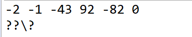
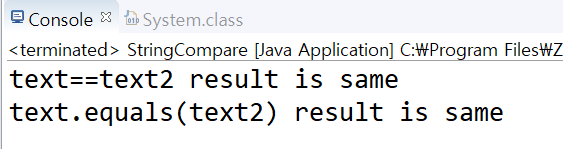

## String class

String 의 주요 메서드는 indexOf(), 문자열의 일부 값을 잘라내는 (subString,subSequence) 등이다. 

``` 
public final class String extends Object
    implements Serializable, Comparable<String>, CharSequence
```

String 클래스는 위와 같이 선언되어 있다. 

- String 클래스는 final 로 선언되어 있기 때문에 타 클래스가 String을 상속받지 못한다. 
- 구현1. Serialzable 은 인터페이스 이지만, 구현해야 하는 메소드가 하나도 없다. Serializable 을 구현한다고 선언하면, 해당 객체를 파일로 저장하거나 다른 서버에 전송가능한 상태가 된다. 
- 구현2. Comparable 인터페이스 CompareTo() 메서드 하나만 선언 되어 있음. 매개 변수로 넘어가는 객체와 현재 객체가 같은지를 비교한다. 
equals() 랑 달리, 객체의 순서 처리에 집중. 해당 메서드의 리턴타입은 int. 같으면 0, 순서 상 앞이면 -1, 뒤면 +1 을 리턴. 
- 구현3. CharSequence 는 해당 클래스가 문자열을 다루기 위한 클래스임을 명시(StringBuffer와 StringBuilder 도 CharSequence를 구현한다)

(1) String 클래스의 생성자

여러가지가 있는데, 많아서 그 중 하나만 보자면, String(byte[] bytes) 다. 현재 사용중인 플랫폼의 캐릭터 셋을 사용해서 제공된 byte 배열을 디코딩한 String 객체를 생성한다. 
byte 배열이란? 디코딩은 왜 하는가? String 클래스에는 현재의 문자열 값을 byte 배열로 변환하는 getBytes 같은 메소드들이 있다. 

(2) 캐릭터 셋이란? 특수 문자다. 알파벳을 제외한 나라의 문자. 한글도 알파벳이 아니기에, 고유의 캐릭터 셋을 가진다. 웹페이지에서 한글이 깨지는 이유는 브라우저에서 생각하는 
캐릭터 셋과 웹 페이지에 지정된 캐릭터 셋이 다르기 때문이다. 

```
public class StringSample {
	public static void main(String[] args) {
		StringSample sample = new StringSample();
//		sample.convert();
		sample.convertUTF16();

	}

	public void convert() {
		try {
			String korean = "한글";
			byte[] array1 = korean.getBytes();
			for (byte data : array1) {
				System.out.print(data + " ");
			}
			System.out.println();
			String korean2 = new String(array1); // array1은 byte 형태의 배열 byte[]. String 생성자에 넣어서 다시 String 으로 변환.
			System.out.println(korean2); // 원래의 값이 그대로 출력.

		} catch (Exception e) {
			e.printStackTrace();
		}
	}

	public void printByteArray(byte[] array) {
		for (byte data : array) {
			System.out.print(data + " ");
		}
		System.out.println();

	}

	public void convertUTF16() {
		try {
			String korean = "한글";
			byte[] array1 = korean.getBytes("UTF-16");
			printByteArray(array1);
			String korean2 = new String(array1);
			System.out.println(korean2);
		} catch (Exception e) {
			e.printStackTrace();
		}
	}
}
```
결과 


잘못된 캐릭터 셋으로 변환하면 알아볼 수 없는 문자로 표시된다. 글자 깨짐 현상을 방지하려면, byte 배열 생성 시 사용한 캐릭터 셋을 다시 문자열 변환할 때도 사용해야 함. 

String 생성 시에, 캐릭터 셋도 같이 넣어주자. 그러면 한글이 잘 표시됨. 
```
	public void convertUTF16() {
		try {
			String korean = "한글";
			byte[] array1 = korean.getBytes("UTF-16");
			printByteArray(array1);
			String korean2 = new String(array1, "UTF-16");
			System.out.println(korean2);
		} catch (Exception e) {
			e.printStackTrace();
		}
	}
```

(3) 객체의 null 체크 필요성 

String 뿐만 아니라 모든 객체를 처리할 때에는 널 체크를 반드시 해야만 한다. 어떤 참조 자료형도 null이 될 수 있다. 

객체가 null이면,
a. 객체가 아무런 초기화가 되어 있지 않다 b. 클래스에 선언 되어 있는 어떤 메소드도 사용할 수 없다. 

-> null 체크를 하지 않으면, 객체에 사용할 수 있는 메소드들은 모두 예외를 발생시킴. 널인 객체의 메서드를 호출하는 순간 예외를 발생시키는 것. 

```
public class StringNull {
	public static void main(String args[]) {
		StringNull sample = new StringNull();
//		sample.nullCheck(null);
		sample.nullCheck2(null);

	}

	public boolean nullCheck(String text) {
		int textLength = text.length();
		System.out.println(textLength);
		if (text == null)
			return true;
		else
			return false;
	}

	public boolean nullCheck2(String text) {
		if (text == null) {
			return true;
		} else {
			int textLength = text.length();
			System.out.println(textLength);
			return false;
		}
	}
}
```

sample.nullCheck를 불렀을 때, nullPointerException 이 뜬다. 컴파일은 정상적으로 되지만, 런타임 에러가 발생하는 이유: 객체가 널인지 아닌지는 실행 시에만 알 수 있어서
메소드의 매개변수로 넘어오는 객체가 null일 확률이 조금이라도 있다면, 꼭 확인하자. 

(4) 문자열이 같은지 비교하는 메서드 

equals() 메서드 

```
	public void checkCompare() {
		String text = "Check value";
		String text2 = "Check value";
		if (text == text2) {
			System.out.println("text==text2 result is same");
		} else {
			System.out.println("text==text2 result is different");
		}
		if (text.equals("Check value")) {
			System.out.println("text.equals(text2) result is same");
		}
	}
```



이미 만들어진 상수를 이용하기 때문에 같은 값으로 인식한다. (첫 번째에 대한 답이 same 인 이유) 
자바에 ConstantPool 이라는 게 존재한다. 자바에서는 객체들을 재사용하기 위해 Constant Pool 이라는 것이 만들어져 있다. String의 경우 
동일한 값을 갖는 객체가 있으면, 이미 만든 객체를 재사용함. text 와 text2 는 같은 객체다. 아래와 같이 선언하면, 다른 객체로 나옴 (constant 풀 사용 안하고 새로운 객체 생성해서, 주소가 달라졌기에 첫 줄은 DIFFERENT 가 된다. ) 


```
		String text2 = new String("Check value2");

```

(5) indexOf(): String 클래스에서 가장 많이 사용되는 메소드 중 하나.
- indexOf() 앞에서부터 문자열, Char 를 찾음. 
- lastIndexOf() 는 뒤에서부터 찾는다. 

Static 하게 호출한다는 것의 의미: 객체 변수가 아니라 클래스에서 불러온다는 뜻.

```
class Counter {
	static int count = 0;

	Counter() {
		count++;
		System.out.println(count);
	}

	public static int getCount() {
		return count;
	}
}

public class Sample {
	public static void main(String[] args) {
		Counter c1 = new Counter();
		Counter c2 = new Counter();

		System.out.println(Counter.getCount()); // 스태틱 메서드는 클래스를 이용하여 호출
		//System.out.println(c1.getCount()); // 객체 x
	}
}
```

아래와 같이 char 배열 메서드를 String 클래스에서 호출할 수 있다.
이유는, String 객체 내부에 char 배열이 포함되어 있기 때문이다.
```
public class StringCheck2 {

	public static void main(String[] args) {
		// TODO Auto-generated method stub
		StringCheck2 sc = new StringCheck2();
		char values[] = new char[] { 'J', 'A', 'V', 'A' };
		String javaText = String.copyValueOf(values);
		System.out.println(javaText);
	}
}
```

기본자료형을 String 타입으로 변환할 떄.
(1) String과 합치거나 (2) valueOf() 메서드를 사용.

-> valueOf()에서 매개변수로 객체가 넘어왔을 떄, toString()을 구현한 객체나 정상적인 객체를 넘겨주면, toString()의 결과를 리턴해준다. 
하지만 null이면 toString()메서드를 사용할 수 없다. NullPointerException이 발생하기 때문. valueOf는 null이면 null을 리턴해준다. 

String 과 immutable

String 은 immutable 한 객체이기 때문에, 한 번 만들어지면 그 값을 바꿀 수 없다. 
string 문자열을 더하면, 새로운 객체가 생성되고 기존 객체는 버려진다. Garbage Collection 의 대상이 된다. 

이러한 String 클래스의 단점을 보완하기 위해 (1)StringBuffer (2) StringBuilder 가 등장한다. 
StringBuffer 는 ThreadSafe 하기 때문에 StringBuilder 보다 안전하다. 단 속도는 StringBuilder 가 더 빠르다. (ThreadSafe를 안하기 떄문에) 
두 클래스 모두 문자열을 더해도 새로운 객체를 생성하지 않는다. .append) 메서드를 사용한다. 
JDK5 이상에서는 sTRING 더하기 연산 할 경우, 컴파일 할 떄 자동으로 해당 연산을 StringBuilder 로 변환해준다. 


String, StringBuilder, StringBuffer 의 공통점: 

(1) 문자열을 다룬다. (2) CharSequence를 구현했다 (따라서 하나의 클래스를 사용해서 매개변수로 받는 작업을 할 때, String/StringBuilder 가 아닌 
CharSequence 타입으로 받는 것이 좋다. 

일반적으로 문자열 생성해서 더할 때는 StringBuilder 사용해도 상관없다. 
단, 문자열을 생성해서 더하기 위한 문자열을 처리기 위한 변수가 있고, 여러 쓰레드에서 이 변수를 동시에 접근할 때는 StringBuffer 를 써야한다. 

## 공부 방향성 

꼼꼼하게 읽다보니 속도가 더디다. 본질적인 질문에 답하는 연습에 집중하자.

## 주요 질문
- String이 어떤 클래스인가? 
- String의 주요 메서드?

츨처: 자바의 신 15장 