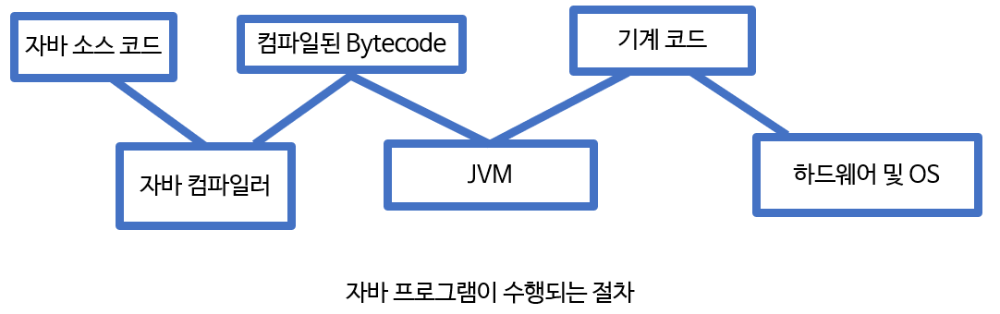
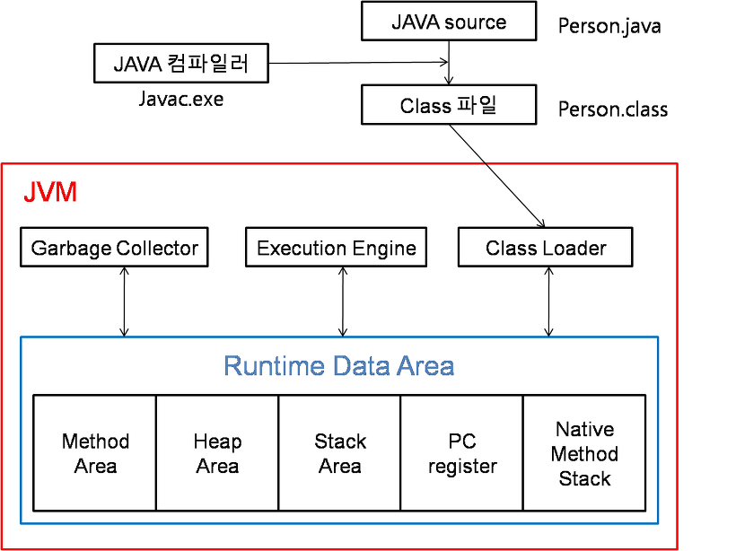
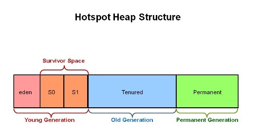
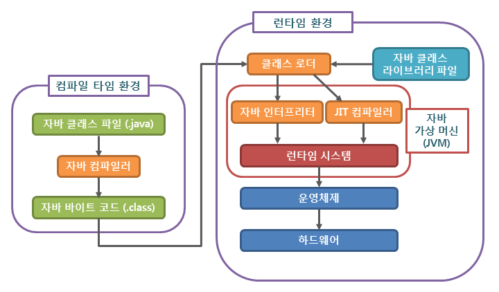

1. 자바 설치 시, JDK 와 JRE 로 분리된다. jre 는 실행만을 위한 환경이다. 
JRE에는 JAVAC 등 자바를 컴파일하는 프로그램은 포함되어 있지 않다. 

2. JIT 컴파일러. 
JIT 는 동적 변환이다. 프로그램 실행을 빠르게 하기 위해서 만들어졌다. 컴파일러이지만, 실행시에 적용된다.
프로그램을 실행하는 방식에는 
(1) 인터 프리터 방식 - 프로그램 실행할 때마다, 컴퓨터가 알아듣는 언어로 변환 
(2) STATIC 컴파일 방식이 있다. 실행하기 전에 컴퓨터가 알아듣는 언어로 변환하는 작업을 미리함. 변환작업은 한 번만 한다.

JIT 은 1,2의 혼합이다. 변환 작업은 인터프리터에 의해 지속적으로 수행하지만, 필요한 코드는 캐시(메모리)에 담아두었다가 재사용함. 

자바의 컴파일 방식 
javac 명령어를 수행하면, class 파일(byte 코드)이 만들어진다. 
이렇게 컴파일한 코드는 리눅스, 맥, 윈도우 등에서 모두 사용 가능하기 때문이다.(moto: compile once, run anywhere)
여기서 컴퓨터가 이해할 수 있도록 다시 변환하는 게 필요하다 (byte 코드는 기계어가 아니기 때문에 os 에서 바로 실행되지 않는다) 
이 변환 작업을 JIT 컴파일러에서 한다 (jvm-> 기계코드 과정)

3.JVM이란

자바 가상 머신: 작성한 자바 프로그램이 수행되는 프로세스.
java 라는 명령어를 통해서 애플리케이션이 수행되면, JVM 위에서 애플리케이션이 동작함. 
JVM은 작성한 프로그램을 찾고 실행함 + 자바 메모리 관리도 해줌. 

*Garvage Collector: 메모리 해제 작업을 하는 C와 달리, JVM 내에서 메모리 관리를 해줌 (필요 없는 객체를 청소함. )

Java7부터는 공식적으로 사용할 수 있는 G1 (Garvage 1st)라는 가비지 컬렉터를 제외한 나머지 jvm 은 다음과 같이 영역을 나누어 힙이라는 공간에 객체들을 관리한다. 

JVM의 구성

(1)ClassLoader
.java 소스를 컴파일하면 .class 파일(바이트 코드 생성)
이렇게 생성된 class 파일을 엮어서, 할당받은 메모리 영역인 RUntime data area 로 적재함. (자바 앱이 실행 중일때 이런 작업이 수행됨)

(2) Execution Engine
class Loader 에 의해 메모리에 적재된 클래스(바이트 코드)들을 기계어로 변경해서 명령어 단위로 실행하는 역할. 
인터프리터, JIT 컴파일러 방식이 있다. 

(3) Garbage Collector
hEAP 메모리 영역에 생성된 객체 중 참조되지 않는 객체(해당 객체를 참조하는 변수가 없으면, 즉 더 이상 사용되지 않으면) 탐색 후 제거한다. 
GC 역할을 하는 시간이 정확히 언제인지는 알 수 없음. GC 수행하는 동안, GC 수행 쓰레드가 아닌 다른 모든 쓰레드는 일시정지됨. 

(4) Runtime Data Area
JVM이 프로그램을 수행하기 위해 OS로 부터 별도로 할당 받은 메모리 영역. 자바 애플리케이션 실행 시 사용하는 데이터를 적재함.
Method area:
- 메소드 영역에서 자바 프로그램의 클래스 코드, 변수 코드, static, final 변수 등이 생성된다.

heap area:
- new 키워드로 생성한 객체가 저장되는 영역
- 동적으로 생성된 객체와 배열이 저장되는 곳으로 Garbage Collection의 대상이 되는 영역이다.
stack area:
- 지역 변수, 파라미터 등이 생성되는 영역, 동적으로 객체를 생성하면 실제 객체는 Heap에 할당되고 해당 레퍼런스만 Stack에 저장된다.
- Stack은 스레드별로 독자적으로 가진다.
- Heap에 있는 객체가 Stack에서 참조 할 수 없는 경우 GC의 대상이 된다.
PC Register: 현재 쓰레드가 실행되는 부분의 주소와 명령을 저장하고 있다.(CPU의 PC Register와 다르다.)
Native Method Stack: 자바외 언어로 작성된 네이티브 코드를 위한 메모리 영역

*힙 영역이 중요한 이유: gc의 주요 대상이기 때문이다. stack고 ㅏmethod도 gc의 대상이지만. 

힙의 구성 

- Young: 젊은 객체
  (1) Eden: 객체가 여기에서 생성됨 저장됨 (2) Survivor: Eden이 꽉 차면, 살아있는 객체만 Survivor로 복사됨. survivor 이 꽉 차면, 다른 survivor2 영역으로 객체가 복사됨. eden 영역에서 살아있는 객체들도 다른 survivor 2로 감.
  -> MINOR, YOUNG GC 

- Old: 늙은, 오래 살아있는 객체들은 old 영역으로 이동함. 지속적으로 이동하다가 old 영역이 꽉 차면 GC 발생. 이를 Major/full GC 라고 부름. 

- Perm: 클래스, 메서드에 대한 정보를 보관함. 

추가 질문 
### **🤔메모리에 load 하고 heap stack 등 메모리 영역을 할당하는 것은 OS이다.하지만 어떻게 JVM이 runtime area를 자바 프로그램에게 할당할 수 있을까?**

- 이유는 OS가 JVM에게 메모리 할당 권한을 주기 때문이다.따라서 OS위에서 메모리를 받아 실행되는 다른 프로그램들과 다르게 자바 애플리케이션의 경우 JVM에게 메모리를 할당받아 실행된다.
- 즉, 자바 애플리케이션은 OS가 아닌 JVM에 종속적이다.자바는 어느 운영체제나 하드웨어에 상관없이 JVM만 있으면, 자바로 작성한 프로그램을 실행시킬 수 있다.

참고:자바의 신 19장
https://github.com/WooVictory/Ready-For-Tech-Interview/blob/master/Java/%5BJava%5D%20JVM.md
https://technote-mezza.tistory.com/72