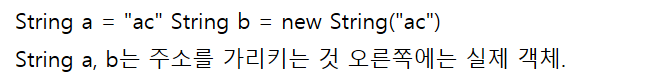

## 객체 지향 용어/개념 정리 


1. 클래스란? 상태와 행위를 갖는 자바의 기본 단위. 

2. 상태와 행위란? 상태는 클래스와 인스턴스 변수, 행위는 메서드로 표현 가능. 

3. 캡슐화란? 
연관된 상태와 행위를 결정하는 기능을 묶어주는 것. 이렇게 묶어주면, 클래스 밖에서 접근 가능한 대상을 제한하는 정보 은닉이 가능해짐. 
+캡슐화, 정보은닉 조금 더 보충해보기. 

모듈화 (하나의 객체를 위한 코드가 다른 객체를 위한 코드와 무관하게 수행)도 가능해짐. 

```
public class Common {
	private int state; //private 선언으로 정보 은닉 
	public void setState(int newState) { // 상태 변경 가능. 
	}
}
```

4. 메시지란? 메소드를 호출할 때 전달하는 값. int newState같은 매개변수들도 메시지에 해당함. 

5. 객체란? 
클래스와 객체의 관계를 보면, 클래스는 사물의 단위이고 객체는 각 사물이라고 보면 된다. 

```
Book godOfJava = new Book(); // Book 은 클래스이고, 객체인 godOfJava는 책 중 하나. 
```

6. 상속이란?
extends 확장이나 implements 구현한 경우. 부모에 선언된 변수나 메서드에 대한 사용권을 갖는다. 

7. 다형성
부모 클래스에서 파생된 자식 클래스의 기능이 다를 수 있다. FirstChild와 SecondChild의 method는 다른 기능. 

```
public class Parent {
	public void method() {
	}
}
```
```
public class FirstChild extends Parent {
	public void method() {
	    { System.out.println("첫째"); }
	}
}
```
```
public class SecondChild extends Parent {
	public void method() {
	    { System.out.println("둘째"); }
	}
}
```

8. Overriding vs Overloading 

Overriding: 자바에서 다형성을 제공하는 하나의 방법. 
부모 클래스에 선언되어 있는 메서드와 동일한 선언을 갖지만 구현이 다를 때. 위의 Child는 Parent 의 메서드를 덮어 쓴 것.
복제에 가깝고. 

Overloading: 메서드의 이름은 동일해도 매개 변수가 다름.

9. 패키지 

(1) 소스의 첫 줄에 존재해야. 
(2) 패키지 이름에 자바 예약어 포함되면 안됨.
(3) 모두 소문자로 구성. 

10. 기본 자료형 
정수형: byte, short ,int, Long, char
소수형: float, double
기타: boolean 

참조 자료형: 기본 자료형 제외 모든 타입. 

차이점
(1) 기본 자료형: 값을 바로 지정하면 되지만, 참조 자료형은 new 생성자로 객체 생성.
(2) 메소드 호출 시 매개 변수: 기본, 참조 자료형 모두 값을 전달하지만 참조 자료형 안에 있는 변수들은 참조 주소를 전달한다. 
*String 은 유일하게 new 를 이용해서 객체 생성할 필요가 없다. 연산도 + 까지 가능한 유일한 클래스. 

10. 변수의 종류
지역 변수: 선언한 곳에서부터 생명 시작, 지역 변수 선언 중괄호가 끝나면 소멸. 
매개 변수: 메소드 호출될 때 생명 시작, 끝나면 소멸. 
인스턴스 변수 : 객체가 생성될 때 생명 시작. 이 객체를 참조하는 다른 객체가 없으면 소멸. 
클래스 변수 : 클래스가 생성될 떄 생명 시작, 자바 프로그램 끝날 때 소멸. 

삼항 연산자 

변수=(boolean 조건식)? true 일 때 값: false 일 때 값; 

11. 반복문
    
(1) While문

```
while(boolean 이 true일 때) {
...
}
```

(2) do-while: 반복 수행을 하기 전에 적어도 한 번은 처리할 필요가 있을 때. 
do{
    처리문장;
} while(boolean 이 true일 때);

(3) for 루프
```
for(int i=0;i<10;i++){

}
```
(4) break vs continue

break는 조건문을 종료하고 continue는 반복문에서 작업을 중단하고, 조건 확인으로 돌아감 

```
int x = 1;
while(x<3){
    x++;
    if(x==1) continue; //while 문으로 돌아가고 
    if(x==2) break; // 조건문을 여기서 종료한다. 

}
```

12. 접근 제어자 



13. 인터페이스, ABSTRACT, CLASS 의 차이.

용도: 
-설계시 선언해두면, 개발 시 기능 구현에만 집중할 수 있기 때문이다. 실제 코드 만들지 않았는데, 어떤 메서드들이 있어야 하는지 정의하고 싶을 때.  
-개발 자 별로 메서드, 변수선언의 격차를 줄일 수 있다. 
-공통적으로 쓰이는 인터페이스, abstract 선언 시 중복을 최소화 할 수 있다
(코드의 재사용, 가독, 유지 보수성 높아짐)

(1) 인터페이스 
- 어떤 메서드가 존재해야 하는지에 대한 선언만 되어 있음 
- 절대로 구현되어 있는 메서드가 있어서는 안됨 (추상 메서드, 상수로만 존재) 
- 인터페이스를 구현하는 클래스에서는 Implements 로 선언 (모든 메서드를 구현해야 컴파일 됨) 
- 인터페이스 여러개를 implements 할 수 있지만, 추상 extends 는 하나만 가능. 

-인터페이스의 용도는 설계 단계에서의 산출물 관리 뿐만 아니라, 외부에 노출되는 것을 정의하는 데도 쓴다. 
인터페이스가 대변인이니, 여기에 직접 얘기하세요. 같은 것. 


``` 

public class MemberManagerImpl implements MemberManager {

	@Override
	public boolean addMember(MemberDto member) {
		// TODO Auto-generated method stub
		return false;
	}

	@Override
	public boolean removeMember(String name, String phone) {
		// TODO Auto-generated method stub
		return false;
	}

	@Override
	public boolean updateMember(MemberDto member) {
		// TODO Auto-generated method stub
		return false;
	}

}
```

```
public abstract class MemberManagerAbstract {
	public abstract boolean addMember(MemberDto member);
	public abstract boolean removeMember(String name, String phone);
	public abstract boolean updateMember(MemberDto member);
	public void printLog(String data) {
		System.out.println("Data=" + data);
	};
}
```

(2) 추상 클래스
- 인터페이스와 달리 (abstract이 아닌) 구현되어 있는 메서드 있어도 됨. 
- abstract  메서드가 1개 이상 일떄는 반드니 abstract 클래스로 선언. 
여기서 abstract 메서드는 내용이 비어있는 메서드다. 절대 구현되어 있어서는 안됨
- abstract 클래스 확장하는 클래스에서는 extends 사용해서 선언.

(3) 클래스
인터페이스, abstract 와는 다르게 모든 메서드가 구현되어 있어야 함. 참고로 클래스는 상속(extends)은 가능하지만 구현(implements)는 안됨. 

14. 자바의 예외 처리 

- checked exception (try-catch 로 묶어줘야 함. 컴파일 시 예외 처리 여부 체크)
- error: 자바 프로세스에 영향. 실행 시 발생. 
- runtime exception/unchecked exception: try-catch 로 묶지 않아도, 컴파일 시 체크를 하지 않음. 실행 시 발생하는 예외 

15. String 클래스
- new를 사용해서 객체 생성할 수 있는 유일한 클래스
- 더하기 연산 가능
- 더하기 연산 할 경우 기존 문자열 버리고 새로운 객체 생성. 
- StringBuffer, StringBuilder: String 의 단점 보완하기 위한 클래스. 
StringBuffer: 스레드에 안전함. String Builder : x.

append 사용해서 문자열을 더한다. 


# 최종 정리 질문들. 

1. 형 변환이란? 형 변환을 해야하는 이유: 각 타입 값 별로 지정할 수 있는 범위가 정해져 이기 때문이다. 

2. switch-case 의 용도. 하나의 값이 여러 범위에 걸쳐 비교 되어야 할때(ex. month)

3. 생성자의 용도란? 
매개변수가 없는 기본 생성자는 자동으로 생성된다.  클래스는 대부분 그 자체만으로 일을 할 수 없고, 객체를 생성해야만 일을 시킬 수 있다. 

4. Overloading이란? 같은 이름의 메서드라도 매개변수를 다르게 함으로써 확장.

5. 패키지 선언 위치와 이름 지정의 유의점
클래스 가장 첫 줄. java 가 들어가면 안된다 

6. static Import: 해당 클리스의 정적 메서드/필드를 클래스명 없이 사용 가능하다. 

7. 클래스는 상태와 행위를 갖는 자바의 기본 단위. 상태: 클래스와 인스턴스 변수, 행위는 메서드로 표현 가능

8. 인터페이스, abstract, 클래스, Enum 클래스. 구분해보기 *** 

9. InstanceOf 의 용도: 객체타입을 확인하는데 사용한다

```
for(ParentCasting tempParent: parentArray){
 if(tempParent instanceof ChildCasting {
    System.out.println("ChildCasting");
 }
}
```

10. 클래스를 상속받아 확장하면 부모 클래스에 선언되어 있는 public, protected 변수, 메서드 사용 가능. 

11. 변수 final 선언 시 변경 불가 
12. static method와 일반 메서드의 차이 (8장)
        static은 객체를 생성하지 않아도 메소드를 호출할 수 있다. 단, 클래스 변수만 사용할 수 있다. static 이 안붙은 인스턴스 변수에서 쓰면,
        "non-static variable name cannot be referenced from a static context"
        public static String name; 이런 식으로 해주면 인스턴스 변수가 클래스 변수가 된다. 이렇게 하면 쓸 수 있지만, 클래스 변수가 되면 ㅗㅁ든 객체에서 하나의 값을 바라보기에 신중해야 함. 

13. try catch finally 블록이란. 
try  {
예외 발생 문장. 
}
catch 
{ 예외 발생 시 처리 
}
finally 
{ 예외 여부 무관하게 반드시 실현 
}