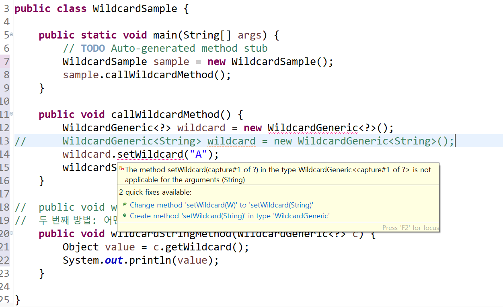

## 제네릭 

1. 제네릭을 쓰는 이유

실수를 방지하기 위함이다. 
제네릭을 쓰면 instanceOf로 타입 점검을 할 필요가 없다. 실행 시 예외 발생 하는 게 아니라 컴파일 시 사전 점검이 가능해진다. 결과적으로 형변환의 안정성을 꾀할 수 있다. 
제네릭을 사용할 때 <>안에 들어가는 타입은 기본적으로 어떤 타입이더라도 상관 없다. 

```
public class WildcardSample {

	public static void main(String[] args) {
		// TODO Auto-generated method stub
		WildcardSample sample = new WildcardSample();
		sample.callWildcardMethod(); 
	}
	
	public void callWildcardMethod() {
		WildcardGeneric<?> wildcard = new WildcardGeneric<?>();
//		WildcardGeneric<String> wildcard = new WildcardGeneric<String>();
		wildcard.setWildcard("A");
		wildcardStringMethod(wildcard);
	}
	
//	public void wildcardStringMethod(WildcardGeneric<String> c) {
//  두 번째 방법: 어떤 타입이 들어가도 상관 없다. 
	public void wildcardStringMethod(WildcardGeneric<?> c) {
		Object value = c.getWildcard();
		System.out.println(value);
	}

}
```
wildcard 는 매개변수로만 사용하는 게 좋다.
<?>로 했을 떄 어떤 타입이든지 들어갈 수는 있지만, wildcard.setWildcard("A")에서는 에러가 난다.
알 수 없는 타입에는 지정해서는 안된다.

제네릭 선언에 사용하는 타입의 범위를 지정하기 (한계: ?로 사용하는 와일드 카드, Bounded Wildcards 타입에는 값을 할당할 수 없다. 조회용 매개변수, 참조 용도로 사용해야 함) 

```
public class CarWildCardSample {

	public static void main(String[] args) {
		// TODO Auto-generated method stub
		CarWildCardSample sample = new CarWildCardSample();
		sample.callBoundWildcardMethod();
		sample.callBusBoundedWildcardMethod();
	}

	public void callBoundWildcardMethod() {
		WildcardGeneric<Car> wildcard = new WildcardGeneric<Car>();
		wildcard.setWildcard(new Car("Mustang"));
		boundedWildcardMethod(wildcard);
	}

	// 제네릭 타입으로 Car을 상속받은 모든 클래스를 사용 가능. 다른 타입이 올 경우, 컴파일 에러.
	public void boundedWildcardMethod(WildcardGeneric<? extends Car> c) {
		Car value = c.getWildcard();
		System.out.println(value);
	}

	public void callBusBoundedWildcardMethod() {
		WildcardGeneric<Bus> wildcard = new WildcardGeneric<Bus>();
		wildcard.setWildcard(new Bus("6900"));
		boundedWildcardMethod(wildcard);
	}

}
```




단, 메소드 선언 시 리턴 타입 앞에 제네릭한 타입을 선언해주고, 그 타입을 매개 변수에 사용하면 컴파일 시 문제가 없다. 값도 할당 가능 

```
public class GenericWildcardSample {
	public static void main(String args[]) {
		GenericWildcardSample sample = new GenericWildcardSample();
		sample.callGenericMethod();
//		genericMethod(WildcardGeneric<T> c, T addValue);

	}

	public <T> void genericMethod(WildcardGeneric<T> c, T addValue) {
		c.setWildcard(addValue);
		T value = c.getWildcard();
		System.out.println(value);
	}

	public void callGenericMethod() {
		WildcardGeneric<String> wildcard = new WildcardGeneric<String>();
		genericMethod(wildcard, "Data");
	}
}

```

