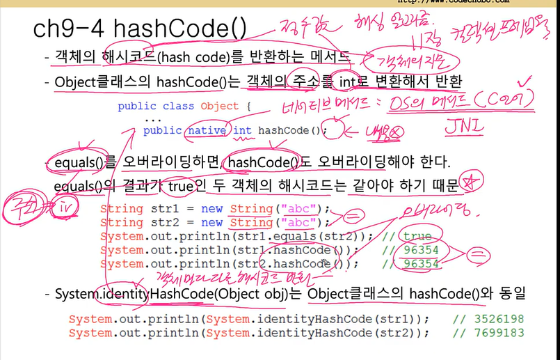

Object 는 모든 클래스의 부모 클래스다. 

자바는 아무 상속을 받지 않으면, java.lang.object 클래스를 확장한다. 
왜? Object 클래스에 있는 메소드들을 통해서 클래스의 기본적인 행동을 정의할 수 있다.
Object 의 메서드 
(A)  객체 처리 메소드 
(B) 쓰레드를 위한 메서드 

(1) toString(): 
해당 클래스가 어떤 객체인지 확인 할 때. Object 클래스에서 가장 많이 쓰임. 객체를 문자열로 표현하는 값 리턴. 

Object 클래스의 toString()
getClass.getName() + '@' + Integer.toHexString(HashCode())


(2) public boolean equals(Object obj)

현재 객체와 매개변수로부터 넘겨받은 객체가 같은지 확인. 
참고: 참조 자료형에서 == 연산자는 주소값을 비교한다 (기본 자료형에서는 값을 비교한다.) 그래서 두 객체가 같은지가 아니라, 주소가 가리키는 값이 같은지 알고 싶다면,  
Object 클래스의 .equals()를 오버라이딩 해야한다. 
참고로, 비교 대상 객체에서 equals()를 오버라이드 하지 않으면, equals() 메서드는 hashcode() 값(객체의 주소위치값)을 비교한다.
서로 다른 객체는 위치가 다르기 때문에, 객체가 다르다는 결과가 나온다.


```
public class Ex9 {
	public static void main(String[] args) {
		Value v1 = new Value(10);
		Value v2 = new Value(10);

		if (v1.equals(v2))
			System.out.println("v1과 v2는 같습니다");
		else
			System.out.println("v1과 v2는 다릅니다");
	}
}

class Value {
	int value;

	Value(int value) {
		this.value = value;
	}

	public boolean equals(Object obj) {
//			return this == obj; //주소 비교. 서로 다른 객체는 false
		// 참조 변수의 형 변환 전에는 반드시 instance Of 로 타입 확인
		if (!(obj instanceof Value))
			return false;
		Value v = (Value) obj; // obj를 value로 형 변환
		return this.value == v.value;
	}
}
```

(3) HashCode 메서드

->(자바 5 doc: 메모리 주소로 hashCode쓰는게 권장된다)
객체의 해시코드 값을 반환하는 메서드 (객체를 식별하는 정수값)

두 객체가 동일하다면, hashCode() 값은 무조건 동일해야 한다. 
인스턴스 변수 값으로 객체의 같고 다름을 판단하는 경우라면, 
equals() 메서드를 오버라이드 하면, hashCode()도 오버라이드 해서 동일한 결과가 나오도록 만들어야 함. 
equals()를 사용해서 비교한 결과가 true 라면, hashCode() 호출 시 동일한 int 를 리턴해야 (true) 

단 equals()에서 false 여도 (다른 객체여도), hashCode 는 true일 수 있다. 
서로 다른 값을 제공하면 hashtable 성능 향상에 도움된다
(ex. 같은 링크드 리스트(서랍)에 저장된 서로 다른 두 데이터)  
단, 이렇게 다른 객체에 대해서 해시코드가 같다고 호출한 결과가 많아질 수록, 해싱을 사용하는 HashMap같은 컬렉션의 검색 속도는 떨어진다.

-> 이러한 제약 때문에 해당 메서드들은 IDE 에서 자동 생성을 권장. 

이유:
둘다 처음에는 주소를 가지고 작업하는 데-> equals() 를 오버라이딩 함으로써 iv 를 가지고 비교하도록 바꿨으니, 
두 객체의 해시코드도 같은 것으로 만들어야 하기 때문이다. 

String 클래스는 문자열의 내용이 같으면, 동일한 해시코드를 반환하도록 hashCode메서드가 오버라이딩 되어 있다. 
문자열의 내용이 같은 str1, str2에 대해 hashCode()를 호출하면 동일한 해시코드 값을 얻는다. 

반면에 System.identityHashCode(Object x)는 Object 클래스의 hashCode 메서드처럼 객체의 주소값으로 해시코드를 생성하기 때문에
모든 객체에 대해 항상 다른 해시코드 값을 반환할 것을 보장한다. 



Object 에서 intern() 메서드를 사용하면 안되는 이유. 
