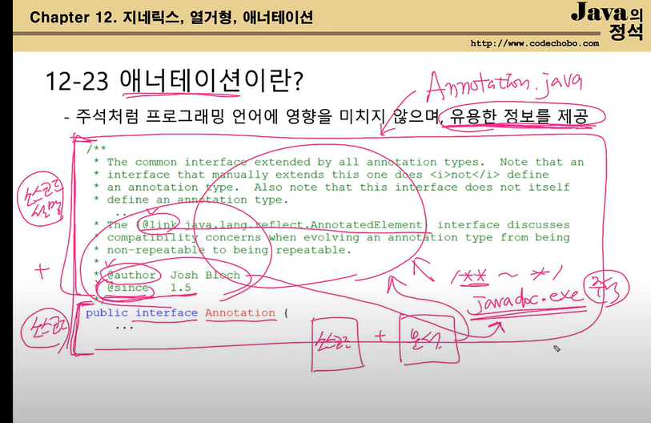
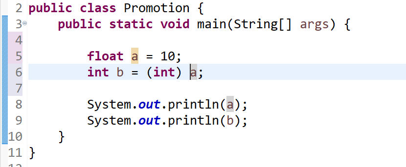
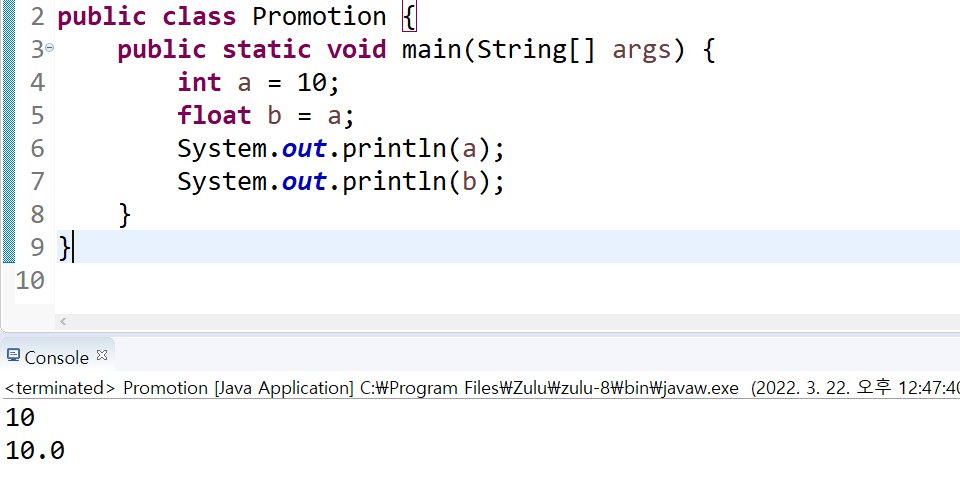

1장 Quiz 

1.Anonymous class란 무엇일까요?

정의: NestedClass(내부 클래스)는 Static nested class와 inner class(내부 클래스) (Local inner, Anonymous inner) 로 나눠진다. 
Anonymous 는 이중 내부 클래스에 속한 클래스다. 

용도: 클래스를 만들고 호출하면, 메모리에 올라간다. 클래스를 많이 만들수록 메모리는 많이 필요하고, 애플리케이션을 시작할 때 더 많은 시간이 소요된다. 
그래서 보다 간단한 방식으로 객체를 만들기 위해서 등장한 것이다. 이름이 없는 일회용 클래스이며 익명클래스는 대개 1회용으로 쓰인다.
Ex. student 라는 클래스가 있음. school의 학생이기 때문에 school 클래스에서만 부르고 싶음. 그럴 때 student 를 내부 클래스로 만든다. 
사용법:
자신의 이름이 없으니까 생성자를 가질 수 없다. new 클래스 이름(); 이렇게 쓸 수 없다. 그래서 대안으로 조상 클래스 이름 혹은 구현 인터페이스 이름을 쓴다. 따라서 단 하나의 클래스만, 혹은 단 하나의 인터페이스만 상속 가능하다.  
클래스 정의와 객체 생성을 한번에 한다. 그래서 객체를 생성할 때마다 같은 클래스를 반복하는 것이 아니라 외부 클래스명$숫자.class InnerEx6, InnerEx6$1 이런 식으로 다른 클래스로 취급 된다. 

일반 객체 생성 
```
public void class() {
 //클래스 선언 
}

//객체 생성 
Class c = new Class(); 

```
익명 클래스
``` 
new 조상클래스 이름() {
   //멤버 선언  
}

new 구현 인터페이스 이름() {
    //멤버 선언 
    
}

```

아래 코드를 Anonymous 로 바꾸어보자. 
```
//자바 정석 ch7-51,52

public class Anonymous {
	public static void main(String[] args) {
		Button b = new Button("Start");
		b.addActionListener(new EventHandler() {

		});
	}
}

class EventHandler implements ActionListener {
	public void actionPerformed(ActionEvent e) {
		System.out.println("ActionEvent occurred!!");
	}	
}

```

```
//자바 정석 ch7-51,52
public class Anonymous {
	public static void main(String[] args) {
		Button b = new Button("Start");
		//Anonymous1.class
		b.addActionListener(new ActionListener() {
			public void actionPerformed(ActionEvent e) {
				System.out.println("ActionEvent occurred!!");
			}
		});
		
		//두 번 불러와도 되지만, 같은 것을 두 번쓰는 것이 X.Anonymous2.class

        b.addActionListener(new ActionListener() {
            public void actionPerformed(ActionEvent e) {
                System.out.println("ActionEvent occurred!!");
            }
        });
	}
}

```


2.자바의 annotation이란 무엇일까요?

에너 테이션은 주석 처럼 프로그래밍 언어에 영향을 미치지 않으면서도, 다른 프로그램에 유용한 정보를(ex. 설정 정보) 제공한다
이전에는 소스코드를 작성하면, 프로그램에 대한 문서를 따로 작성했었다 (ex. 설정파일 xml )
소스 코드를 변경하면, 문서도 변경했어야 했음. 변경 중에 소스코드 <-> 문서 간의 불일치라는 문제도 발생했다.  
관리를 쉽게 하기 위해 문서와 소스코드를 합치면서 어노테이션이 등장했다. 어노테이션이 만들어지면서, 각 설정이 필요한 위치에 관련 설정 역시도 존재하게 됨에 따라서 코드 가독성이 좋아졌다.
.이제는 점점 별도 설정 파일을 쓰지 않고, annotation 같은 데 정보를 심는 추세다.


소스 코드의 javadoc 주석 /**~*/에는 소스 코드에 대한 정보를 저장하고,
프로그램(JAVADOC.EXE)이 이 주석으로부터 HTML 문서를 생성해낸다. 
xml 공유의 단점도 줄어들었다. 

@Test 를 예로 들어보자. 특정 메서드만 테스트 하기 원한다면 @Test 를 메서드 앞에 붙이면 된다. @Test는 '이 메서드를 테스트 한다' 라는 것을 테스트 프로그램에 알리는 역할을 할 뿐, 
메서드가 포함된 프로그램 자체에는 아무런 영향을 미치지 않는다.

어노테이션은 표준 어노테이션과 메타 어노테이션 (어노테이션 선언 시 사용)

어노테이션의 용도

(1) 컴파일러에게 정보 알려주기
(2) 컴파일할 때와 설치 시의 작업을 지정하기
(3) 실행할 때 별도의 처리 해주기 

*어노테이션은 상속이 되지 않는다. 모든 어노테이션의 조상은 Annotation 인터페이스이지만, 어노테이션은 상속이 허용되지 않기 때문에 명시적으로 extends Annotation 이 불가능함. 

(1) @Override
해당 메서드가 부모 클래스에 있는 메서드 Override 했다는 것을 명시적으로 선언. 
이렇게 해두면, 어떤 메서드가 Override 되었는지 쉽 게 알수 있고, 매개 변수가 빠지거나 했을 때 컴파일 시 파악이 용이함. 

(2) Deprecated
이미 만들어져 있는 클래스, 메서드가 더 이상 사용되지 않을 때. 

(3) SupressWarnings
컴파일 시 에러가 나더라도, 나도 알고 있으니까 눈 감아줘라고 이야기하는 것. 
묵인해야하는 경고가 발생하는 대상에 사용 -> 컴파일 시 에러메시지가 나타나지 않게. .

(4) FunctionalInterface
함수형 인터페이스를 선언할 때, 컴파일러가 '함수형 인터페이스'를 올바르게 선언했는지 확인. 잘못된 경우 에러 발생 

(5) SafeVarargs 
지네릭스 타입의 가변인자에 사용 

(6) Native: native 메서드에서 참조되는 상수 앞에 붙임. 
네이티브 메서드: JVM이 설치된 os 의 메서드. 


메타 어노테이션
에너테이션을 정의할 때 에너테이션의 적용 대상, 유지기간 등을 정의

@Target	애너테이션이 적용가능한 대상을 지정하는데 사용한다.
@Documented	애너테이션 정보가 javadoc으로 작성된 문서에 포함되게 한다.
@Inherited	애너테이션이 자손 클래스에 상속되도록 한다.
@Retention	애너테이션이 유지되는 범위를 지정하는데 사용한다.
@Repeatable	애너테이션을 반복해서 적용할 수 있게 한다.(JDK1.8)

https://shj7242.github.io/2017/08/28/JAVA10/
출처: https://dololak.tistory.com/783 [코끼리를 냉장고에 넣는 방법]

3. lombok에 대해서 들어보셨나요? lombok이란 무엇인가요?
   프로젝트 롬복은 어노테이션 기반의 자바 라이브러리 이다.
   롬복은 코드 자동 완성을 통해, getter/setter처럼 반복되는 메서드의 작성 코드를 줄여준다. 코드의 가독성을 높일 수 있다.
   Lombok은 여러가지 어노테이션을 제공하고 이를 기반으로 코드를 컴파일과정에서 생성해 주는 방식으로 동작하는 라이브러리입니다. 
  즉 코딩 과정에서는 롬복과 관련된 어노테이션만 보이고 getter와 setter 메서드 등은 보이지 않지만 실제로 컴파일된 결과물(.class)에는 코드가 생성되어 있다는 뜻입니다.

참고로 getter, setter 같이 별 수정 없이 반복되는 코드를 보일러 플레이트라고 한다 
프로그래머가 (불필요, 복잡, 도움 안되는 반복적인 일 안하도록 보일러 플레이트 코드를 수동 작성하는 걸 줄여야 하는데, 
자바의 롬복 역시도 이러한 계기로 만들어졌다. 같은 코드가 자바 annotation 을 사용한 Lombok 에 의해서 만들어질 수 있다.

``` 
public class Pet {
    private String name;
    private Person owner;

    public Pet(String name, Person owner) {
        this.name = name;
        this.owner = owner;
    }

    public String getName() {
        return name;
    }

    public void setName(String name) {
        this.name = name;
    }

    public Person getOwner() {
        return owner;
    }

    public void setOwner(Person owner) {
        this.owner = owner;
    }
```

```
@AllArgsConstructor
@Getter
@Setter
public class Pet {
    private String name;
    private Person owner;
}
```


5. try-catch-finally문을 사용하고 있습니다. 이중 catch블록에 return 키워드를 사용해 메서드를 종료해버리면, finally구문을 실행될까요?
finally 블록은 예외 발생 여부와 상관 없이 실행되어야 하는 코드 입니다. 
try 블록에서 return 문이 실행되는 경우에도 finally 블록이 실행된 후 현재 문장이 종료되고, 
catch 블록에서 return 문이 실행되는 경우에도 finally 블록이 실행된다. 

단, finally블록에는 return 문을 넣으면 안된다. return의 실행??(더 공부할 것. )

https://tomining.tistory.com/154


7. ENUM클래스란 무엇일까요? 어떨때 사용할까요?
enumeration (셈, 계산, 열거)의 약자다. 서로 관련있는 상수를 모아서, 심볼릭한 명칭의 집합으로 정의한 것이다. 
요일처럼 의미있고 한정적인 데이터 집합을 나타낼 때 사용한다. 
참고로, 모든 열거형의 조상이 java.lang.Enum 이다. 

자바의 열거형은 c언어의 열거형보다 향상되었음. 
열거형의 값 뿐만 아니라 타입도 관리해서 논리적인 오류를 줄인다. 
C언어는 타입이 달라도 값이 같으면 조건식 결과가 참. 자바의 열거형은 타입에 안전해서, 실제 값이 같아도 타입이 다르면 컴파일 에러 발생. 
case 문에 열거형이 아니라 상수 이름만 씀. 어떤 케이스인지 상수형으로 구분 가능해서 가독성이 좋다. 

```
protected Enum(String name, int ordinal)
```

아래와 같이 switch문과 함께 상수 값을 분기하면서도, 자주 사용한다. 
넘겨줄 때는 enum class.상수이름 형태로 넘겨준다. 
```

public class OverTimeManager {
	public int getOverTimeAmount(OverTimeValues value) {
		int amount = 0;
		System.out.println(value);
		switch (value) {
		case THREE_HOUR:
			amount = 18000;
			break;
		case FIVE_HOUR:
			amount = 30000;
			break;
		case WEEKEND_FOUR_HOUR:
			amount = 40000;
			break;
		case WEEKEND_EIGHT_HOUR:
			amount = 60000;
			break;
		}

		return amount;
	}
}

```

enum 클래스와 생성자
-enum 클래스는 일반 클래스와 마찬가지로, 컴파일할 때 생성자를 자동으로 만들어준다,
-참고로 enum의 생성자는 private / package private(아무것도 지정하지 않는)만 가능하다. 

-enum 클래스는 Object클래스가 부모이기 때문에, Object 클래스의 메소드들을 모두 사용할 수 있다. 하지만 개발자들이 Object 클래스 중 아래 4개의 메서드를 Overriding 하지 못하도록 막아두었다.
clone(), finalize() / 이 둘은 사용하면 안된다. hashCode(), Equals()

enum 의 장점은
(1) enum 키워드 사용을 통해 구현의 의도가 열거임을 나타낼 수 있다. 
(2) 코드의 단순화로 가독성 향상

https://www.nextree.co.kr/p11686/

8. 타입 프로모션과 타입 캐스팅은 무엇일까요?

타입 캐스팅이란? 

캐스팅은 형변환이라는 뜻이다. 서로 다른 타입 간의 연산을 수행해야 할 때는 연산을 수행하기 전에 타입을 일치시켜야 한다. 
이때, 변수나 리터럴의 타입을 다른 타입으로 변환하는 것을 '형변환'이라고 한다. 형변환 하고자 하는 변수/리터럴 앞에 (타입)을 붙여주면 된다. 타입 캐스팅은 강제(명시적) 형변환이라고도 부른다. 




타입 프로모션이란?
타입 프로모션은 자동(묵시적) 형변환이다. 크기가 더 작은 자료형을 더 큰 자료형에 대입할 때, 작은 자료형이 자동으로 큰 자료형으로 변환되는 현상이다. 
서로 다른 타입의 변수간의 연산은 형변환을 하는 것이 원칙이지만, 작은 타입 -> 큰 타입으로의 변환은 형 변환을 생략해도 컴파일러가 알아서 해준다.



- 기본형에서의 형 변환.
boolean을 제외한 나머지 타입들은 서로 형 변환이 가능하다. 
- 기본형 <-> 참조형은 형 변환이 불가능하다.
- 큰 타입 -> 작은 타입 (ex. int-> byte )으로 변환할 때는 값 손실이 있을 수 있다. 
  반대로 작은 타입 -> 큰타입으로의 변환은 값 손실이 발생하지 않고, 나머지 빈 공간이 0 또는 1로 채워진다 
