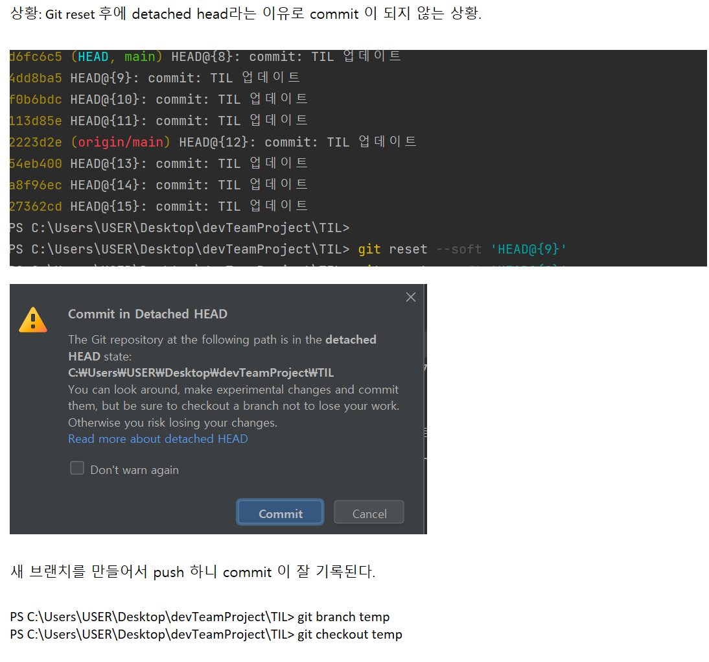
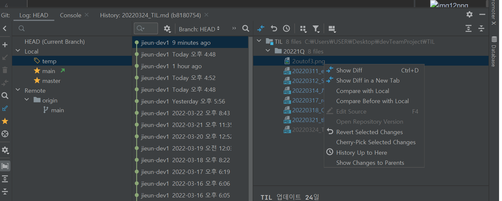

1. Programmers 문제 풀이 (해시맵)


막힌 포인트: 중복 값을 허용하지 않으려면, Hash가 아니라 ArrayList를 써야 하는거 아닌가? 
ArrayList 를 HashSet으로 바꾸어봐도 결과는 똑같다.
```
	public String solution(String[] participant, String[] completion) {
		HashSet<String> parti = new HashSet<>(Arrays.asList(participant));
		HashSet<String> compl = new HashSet<>(Arrays.asList(completion));
		ArrayList<String> answerList = new ArrayList<String>(); 
		answerList.addAll(parti);
		answerList.removeAll(compl);
		String answer = "";
		for(String item:answerList) {
			answer+=item; 
		}
		return answer; 
	}
```

map.keySet(): key 를 가져오는 메서드. 

getOrDefault / get : 똑같이 key 에 대한 value 를 반환하지만, getOrDefault 를 쓸 때, 
중복인 경우/아닌 경우 모두 처리해줄 수 있다. 

.put(key, value): key와 value 모두 기입 가능. 

##
Git reset 하기 

Git commit 을 지우고 싶어서, 인텔리제이로 Cherrypick, reset 을 하다가 혼났다.. 
CLI 로 충분히 익숙해지기 전에 GUI 하다가는 Disaster 로 가는 지름길이라던 stackoverflow 말을 오래 기억할것 같다 흑흑. 
Git 에러 날때마다 여기 시간쓰는게 너무 아까우면서도, 현업으로 가기 전에 미리 꼬여보고, 풀어보는 연습을 해야겠다는 생각도 든다. 

과거로 넘어오려다가, 1시간 전이 아닌 2일 전으로 넘어온 상황. 다시 앞으로 가기 위해서 
우선은 Git Reflog 로 지금까지 참조된 모든 커밋 기록을 볼 수 있다. 
돌아갈 시점을 찾아서 reset 을 한다. 



그런데 일부 파일은(회색 표시) 왜인지 따로 revert selected changes 처리를 해주어야 했다. 
-> 검색해도 딱히 안나와서 시간을 두고 찾아봐야겠다. 



-GUI 는 편하지만 생각하고 쓰자. 
-