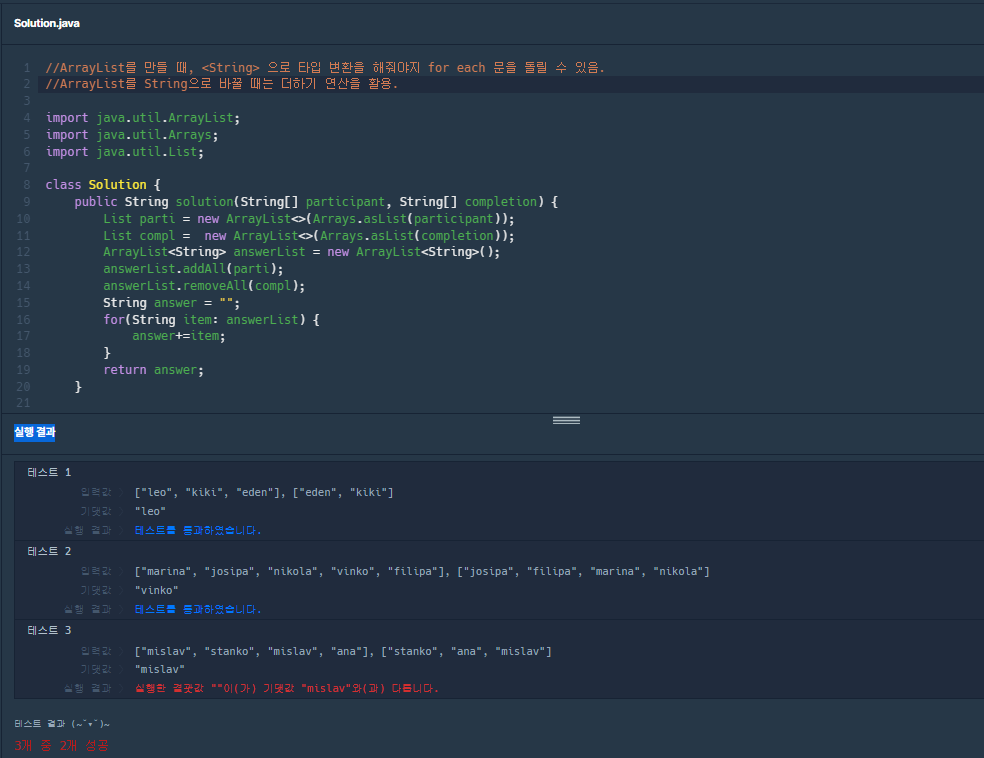

Programmers 문제 풀이 (해시맵)



막힌 포인트: 중복 값을 허용하지 않으려면, Hash가 아니라 ArrayList를 써야 하는거 아닌가? 
ArrayList 를 HashSet으로 바꾸어봐도 결과는 똑같다.
```
	public String solution(String[] participant, String[] completion) {
		HashSet<String> parti = new HashSet<>(Arrays.asList(participant));
		HashSet<String> compl = new HashSet<>(Arrays.asList(completion));
		ArrayList<String> answerList = new ArrayList<String>(); 
		answerList.addAll(parti);
		answerList.removeAll(compl);
		String answer = "";
		for(String item:answerList) {
			answer+=item; 
		}
		return answer; 
	}
```

map.keySet(): key 를 가져오는 메서드. 

getOrDefault / get : 똑같이 key 에 대한 value 를 반환하지만, getOrDefault 를 쓸 때, 
중복인 경우/아닌 경우 모두 처리해줄 수 있다. 

.put(key, value): key와 value 모두 기입 가능. 