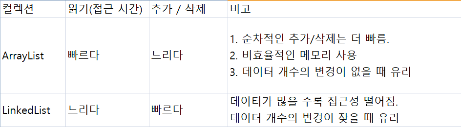

자바의 정석 11장 

참고: 시간 복잡도
O(1) VS O(N)

O(1)일 때는 입력 자료의 수에 상관 없이 일정 시간. 

O(n)은 입력 자료의 크기가 N일 경우 N 번만큼의 수행 시간을 가진다. 
ex) 연결 리스트 순회. 
https://velog.io/@leobit/%EB%B3%B5%EC%9E%A1%EB%8F%84Complexity

### 배열 
Array 와 
ArrayList (ArrayList 와 LinkedList 는 리스트 인터페이스의 구현체지만, ArrayList는 여전히 배열의 특성을 많이 갖고 있다)

### 링크드 리스트

링크드 리스트 클래스는 링크드 리스트가 아닌 더블 링크드 리스트로 구현되어 있다.
더블 링크드 리스트는 링크드 리스트와 같고, 이전 요소에 대한 접근이 가능해서, 각 요소에 대한 접근/이동이 더 쉽다. 
링크드 리스트의 단점인 '낮은 접근성'을 높이기 위함.

### ArrayList vs LinkedList

(1) 순차적 추가/삭제의 경우: Array
*여기서 순차적 삭제란, 마지막 데이터 부터 삭제하는 것. 
ArrayList의 크기가 충분치 않으면, 새로운 크기의 ArrayList 생성하고 데이터 복사해야 함. 
순차적으로 데이터 추가해도 ArrayList 보다 LinkedList 가 빠를 수 있다. 
ArrayList 는 마지막 데이터부터 삭제할 떄 각 요소들의 재배치 필요 없음. 마지막 요소만 null로 바꾸면 된다. 

(2) 중간 데이터 추가/삭제: Linked

Linked: 각 요소의 연결만 변경. Array: 각 요소 재배치 해서 추가 할 공간 확보 or 빈 공간 채워야 해서 처리 속도가 늦다. 
Linked 의 단점은 저장해야 하는 데이터의 갯수가 많아질 수록, 데이터를 읽어 오는 시간 접근 시간은 길어진다는 것. 



### 스택 VS QUEUE

스택: LastInFirstOut 
큐: FirstInFirstOut 

큐 구현 시, LinkedList 를 사용하는 것이 적합하다. 데이터의 추가 삭제가 쉽기 때문. ArrayList 라면, 
데이터 꺼낼 때마다 빈 공간이 생겨서, 데이터의 복사를 해야함. 

```
//stack 구현 
public class MyStack extends Vector {
	public Object push(Object item) {
		addElement(item);
		return item; 
	}
	
	public Object pop() {
		Object obj = peek(); //satck 에 저장된 마지막 요소를 읽어온다. 
		//만약 stack에 비어 있으면, peek() 메서드가 EmptyStackException 발생시킴. 
		//마지막 요소를 삭제한다 (배열 index가 0부터 시작하니까 1을 빼준다.
		removeElementAt(size()-1);
		return obj;
	}
	
	public Object peek() {
		int len = size(); 
		
		if (len == 0) 
			throw new EmptyStackException();
		//마지막 요소를 반환한다. 배열의 index가 0부터 시작하므로 1을 빼준다. 
		return elementAt(len-1);		
	}
	public boolean empty() {
		return size() == 0; 
	}
	
	public int search(Object o) {
		int i = lastIndexOf(o); //끝에서부터 객체 찾기. 반환 값은 저장된 위치
		if (i >= 0) { // 객체를 찾은 경우 
			return size() - i; //Stack 은 맨 위에 저장된 객체의 index 를 1로 정의하기 때문에, 계산을 통해서 구하자
		}
			return -1 ; // 해당 객체를 찾지 못하면-1 반환. 
	}
		
	}
```
큐의 종류

(1) PriorityQueue 

저장한 순서에 관계 없이 수선순위가 높은 것 부터 꺼낸다. null 저장은 불가. 

저장 공간으로 배열을 사용하고, 각 요소를 Heap 자료 구조 형태로 저장. 

힙은 이진 트리의 한 종류다.  가장 큰 값이나, 가장 작은 값을 빠르게 찾을 수 있다. 

(2) Deque (Double ended Queue) 
Stack 과 Queue 를 합쳐 놓은 것. stack으로도, Queue 로도 사용할 수 있다. 
Queue 는 한 쪽 끝으로만 추가/삭제가 가능. Deque 는 양쪽 끝에 추가/삭제가 가능하다. 
Deque 의 조상은 Queue. 구현체: ArrayDeque, LinkedList 

### 컬렉션에 저장된 요소에 접근하는 인터페이스 

Iterator, ListIterator, Enumeration 

Iterator: 단방향으로 이동 가능. 

ListIterator: 양방향으로 조회 가능 (List 인터페잇를 구현한 경우 만. ex. ArrayList, LinkedList)

Enumeration: Iterator 의 구버전. 