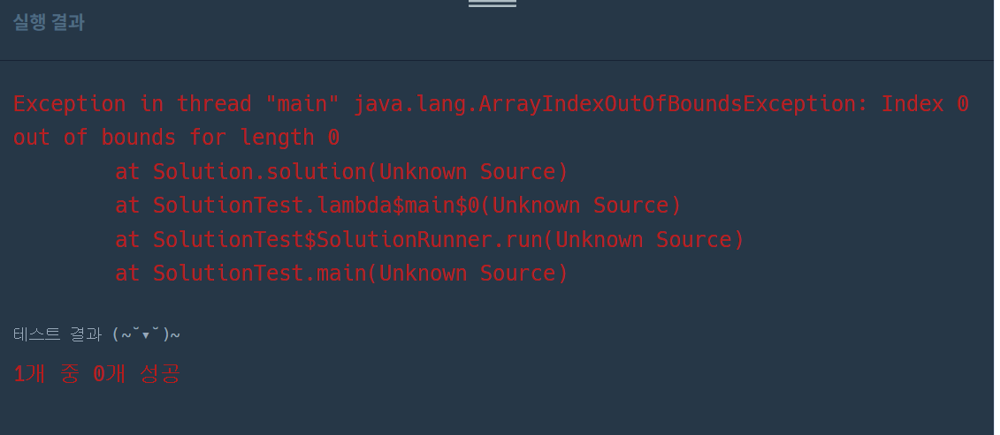
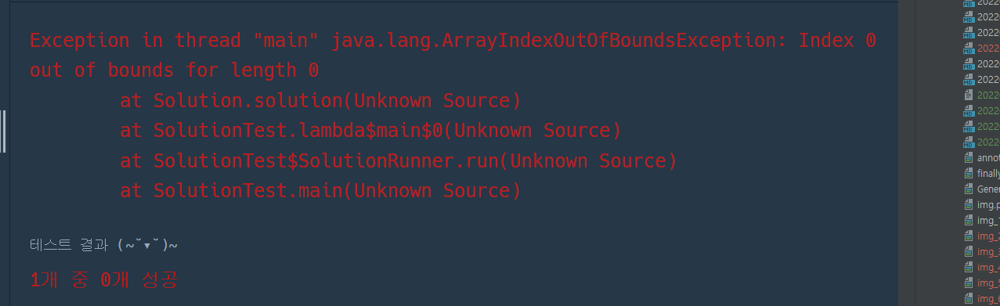

프로그래머스 K 번째 수 풀이 

ArrayIndexOutOfBoundsException 의 원인을 모르겠다.
1시간반풀어봤는데 마땅치 않아서 답을 보자. 
```
class Solution {
    public int[] solution(int[] array, int[][] commands) {
        int[] answer = {};
        ArrayList<Integer> list = new ArrayList<Integer>();
 
        for(int pi=0;pi<commands.length;pi++) {
            int pj = commands[pi][2];
            int[] answer1 = Arrays.copyOfRange(array, commands[pi][0] -1, commands[pi][1]);
            Arrays.sort(answer1);
            answer[pi] = answer1[pj]; 

        }
        return answer;        
    }
}
```





```
import java.util.*;

class Solution {
    public int[] solution(int[] array, int[][] commands) {
        int[] answer = {};
        ArrayList<Integer> list = new ArrayList<Integer>();
 
        for(int pi=0;pi<commands.length;pi++) {
            int pj = commands[pi][2]-1;
            int[] answer1 = Arrays.copyOfRange(array, commands[pi][0] -1, commands[pi][1]);
            Arrays.sort(answer1);
            answer[pi] = answer1[pj]; 
        }
        return answer;        
    }
}
```

```

```

index 에러가 났던 이유가 매우 간단했다. answer[pi] 처럼 인덱스를 찾아서 값을 입력해주었는데,
알고보니 배열 초기화 시 아예 사이즈를 정해주지 않았다. 