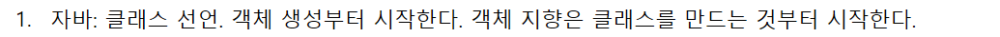

HashMap 에서 value 값에 객체를 생성해서 넣을 수도 있다. (완전 짱.. 그런 생각처음해봄)

점화식 또는 재귀식: 수열에서 이웃하는 두 개의 항 사이에 성립하는 관계를 나타낸 관계식이다.
재귀함수: 자기 자신을 호출하는 함수
function resursive(인자) {
작업 수행
if (조건 충족) {
return 결과
} else {
return recursive(작업된 인자) }
}


풀이 참고: https://dev-note-97.tistory.com/267

int가 1 미만이면 0으로 간주된다. 


기본값으로 "-"를 넣어줘야 한다. 


```
import java.util.HashMap;

class Solution {

	public int[] solution(String[] enroll, String[] referral, String[] seller, int[] amount) {
		HashMap<String, Person> people = new HashMap<>();
		int[] answer = new int[enroll.length];
        people.put("-", new Person("-")); // -를 추가해야 함. center 인 민호를 추가해야 함 '-'. HashMap은 Map을 구현해서, Key는 중복이 들어가지 않는다. 
		// int[] answer = {}; 가 아니라, 배열이니까 길이 주어져도 됨.
		for (int i = 0; i < enroll.length; i++) {
			people.put(enroll[i], new Person(enroll[i])); //이때도 여전히 parent null임
		}

		for (int i = 0; i < referral.length; i++) {
			people.get(enroll[i]).parent = people.get(referral[i]);
			// 이렇게 하면, referral[i]가 key가 되고(오른쪽), 이에 대한 value 값을 (왼쪽) 정해줄 수 있음.
			// mary가(referral[i]가 가리키는 value 값이 Edward의 Value인 Person 객체의 Parent 로 연결.
		}

		for (int i = 0; i < seller.length; i++) {
			addProfit(people.get(seller[i]), amount[i] * 100);
		}

		for (int i = 0; i < enroll.length; i++) {
			answer[i] = people.get(enroll[i]).profit;
		}
		return answer;
	}

	public void addProfit(Person person, int profit) {
		int profit_for_parent = profit / 10;
		if (person.parent != null && profit_for_parent != 0) {
			person.profit += profit - profit_for_parent;
			addProfit(person.parent, profit_for_parent);
		} else {
			person.profit += profit;
		}
	}

	 class Person {
		String name;
		Person parent;
		int profit;

		public Person(String name) {
			this.name = name;
			this.parent = null;
			this.profit = 0;
		}
	}

}
```

