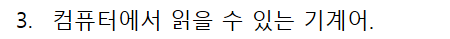

오답 
```
package Programmers;

import java.util.HashMap;

class Solution {
    int[] answer = new int[2];
    int maxCnt = 0;
    int minCnt = 0;
    HashMap<Integer, Integer> hm = new HashMap<>(); 

    public int[] solution(int[] lottos, int[] win_nums) {

        for(int i=0;i<lottos.length;i++) {
        	if (i==0) maxCnt++; 
        }        
        HashMap<Integer, Integer> hm = new HashMap<>(); 
        for(Integer key:lottos) {
        	hm.put(key, hm.getOrDefault(key, 1));
        	}
        for(Integer key:win_nums) {
        	hm.put(key, hm.get(key)+1);
        	}
        
        for(Integer key:lottos) {
            if (hm.get(key) == 2) {
            	maxCnt++;
            } else if (key == 0) {
            	minCnt = maxCnt - 1; 
            }
        	}
        answer[0] = maxCnt;
        answer[1] = minCnt; 
   
       return answerRank(answer); 
    } 
    
    public int[] answerRank(int[] answer) {
    	int[] rank = new int[2];
     for(int i=0;i<2;i++) {
    	 if (answer[i] == 6) {
    		 rank[i] = 1; 
    	 } else if (answer[i] == 5) {
    		 rank[i] = 2; 
    	 } else if (answer[i] == 4) {
    		 rank[i] = 3; 
    	 } else if (answer[i] == 3) {
    		 rank[i] = 4; 
    	 } else if (answer[i] == 2) {
    		 rank[i] = 5; 
    	 } else if (answer[i] <= 1) {
    		 rank[i] = 0; 
    	 }
     }
    	return rank;
    }

    }
    

```

1) max 를 따로 셀 필요 없이 0을 세서 더하자.

2) switch 문을 쓸 때는 꼭 default를 써줘야 한다. 아니면 return 하라는 경고 메시지가 뜸.

3) min을 셀 때는 0이 아닌 cntMin의 갯수를 세는 것 (0이 다 틀린 수라고 가정하는 거니까) 
```
    public int getGrade(int n) {
    	switch(n) {
    	case 6:
    		return 1;
    	case 5:
    		return 2;
    	case 4:
    		return 3;
    	case 3:
    		return 4;	
    	case 2:
    		return 5;
    	default:
    		return 6;
    		
    			
    	}
```

이중 for 문에서의 continue 
```
        for(int i:lottos) {
        	if (i==0) {
        		cnt0++;
        		continue; 
        	}
        	for(int j:win_nums) {
        		if(i==j) cntMin++;
        	}
        }
```

# 이번 주 회고 

이번 주에는 코테를 못봤다. 코테는 정말 벼락치기를 할 수 없고, 꾸준히 해야한다는 걸 몸소 느꼈다. 그래서 매일 최소 1-2시간은 할당하기로 했다.
다만 코테까지 하니 새로운 걸 많이 해서 낯설고 에너지 소모가 크다. 이번주에는 주 4일은 유산소 운동을 했는데, 계속 하는 게 목표다. 지치지 않게 운동을 꼭 해주기.  

질문에 대해서 답이 막히는 것 등 이번주는 멘토링도 그리 잘했다는 생각이 들지 않았다. 
자바의 정석을 같이보고, 꼼꼼히 보려다보니 학습량에 압도되었다고 생각한다. 자바의 신 2권의 내용은 대부분 나에게 낯선 것들이어서 사실 깊이보기에는 어려운 부분도 있다. 
자바의 신을 꼼꼼히 보고 이해 안되는 것은 자바의 정석으로 메꿔야겠다. 
